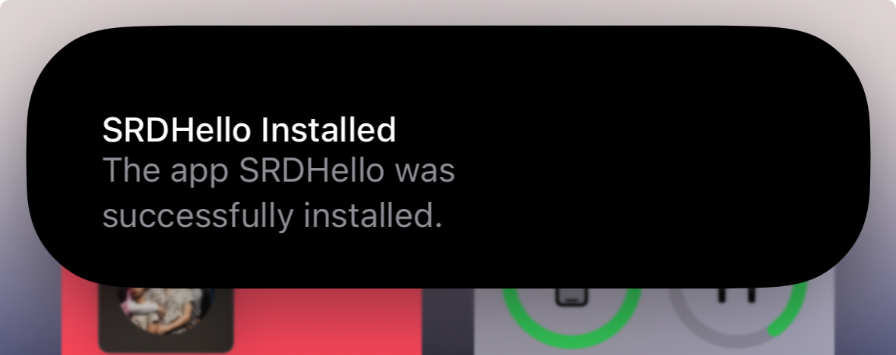

> Disclaimer: this project is provided for use within the [Apple Security Research Device Program](https://security.apple.com/research-device/), use for any purpose outside of security research is outside the scope of the project, please don't report issues or request features that are not within that scope.

# App Registrar Daemon

A daemon that can be installed to an SRD in order to allow for app installation within research cryptexes.

## Requirements

- Security Research Device running iOS 26 or later

## How Does it Work?

Once installed, `appregistrard` runs as a daemon and:

- Installs `libAppRegistrarHooks` and configures injection into `installd`; this small dylib patches `installd` to allow ad-hoc binaries to pass validation, otherwise installation fails
- Checks the `Applications` and `System/Applications` directories within mounted cryptexes
- If found, installs any `.app` bundles found in those directories so that the apps can be launched from SpringBoard as usual

Additionally, the daemon keeps running in the background and automatically installs any apps found in newly-installed cryptexes
so that you can easily have small individual cryptexes for different apps, and `appregistrard` will
automatically make sure those apps are installed when the cryptexes are mounted.

## Build / Install Daemon

You can build a cryptex with `appregistrard` and `libAppRegistrarHooks` from the Xcode project by building the "cryptex" scheme.

To install, after building the "cryptex" scheme in Xcode, run the provided `install` script, which will find the built root in Xcode's derived data and use `srdtool` to install the cryptex.

Alternatively, download the pre-built cryptex root from [releases](https://github.com/insidegui/appregistrard/releases/latest), extract it and provide the path to the extracted `root` directory as the first argument to the `install` script.

The script configures the `appregistrard` cryptex to persist across reboots. Any cryptexes with apps that are also persisted will have their applications installed by `appregistrard` upon first unlock.

## Customizing Behavior (optional)

The latest version uses `installcoordinationd` to trigger app installation, which installs apps the same way as those installed via Xcode or the App Store.

To disable that behavior and fall back to a legacy mode that uses CoreServices to register apps directly, set `APPREGISTRARD_DISABLE_INSTALLCOORDINATION=1` in the environment.
